# Phân biệt ảnh chân dung AI bằng phương pháp học sâu - Kiến trúc lai nhánh


## Giới thiệu (Introduction)

Dự án này đề xuất một kiến trúc học sâu mới (**Hybrid Asymmetric Architecture**) nhằm giải quyết thách thức trong việc phát hiện ảnh Deepfake chất lượng cao.

Thay vì chỉ dựa vào thông tin hình ảnh (RGB), mô hình kết hợp song song hai luồng xử lý:

1.  **Spatial Branch (Miền không gian):** Sử dụng EfficientNet-B1 để nắm bắt ngữ nghĩa và cấu trúc khuôn mặt.
2.  **Frequency Branch (Miền tần số):** Sử dụng biến đổi Fourier (FFT) và các bộ lọc thông cao để phát hiện các dấu vết nhân tạo (artifacts) bất thường mà mắt thường không thấy được.

Hai luồng thông tin được hợp nhất thông qua cơ chế **Residual Attention Fusion**, cho phép mô hình tự động học trọng số tối ưu cho từng nhánh.

## Tính năng nổi bật (Key Features)

- **Multi-modal Analysis:** Kết hợp phân tích đa miền (Spatial + Frequency).
- **Asymmetric Design:** Thiết kế bất đối xứng (Spatial 512-dim, Frequency 256-dim) giúp tối ưu hóa tài nguyên tính toán và giảm nhiễu.
- **Robust Preprocessing:** Tích hợp mô phỏng nén ảnh (JPEG Compression) và nhiễu (Gaussian Noise) để tăng độ bền vững.
- **Two-stage Training:** Chiến lược huấn luyện 2 giai đoạn (Frozen & Fine-tuning) giúp hội tụ ổn định.
- **High Performance:** Đạt độ chính xác >99% trên tập dữ liệu kiểm thử hỗn hợp (Accuracy 98.15%, Recall 99.55%, F1-Score 98.18%, AUC-ROC 0.998 trên tập test 4000 ảnh).

## Dữ liệu (Dataset)

**Kích thước dữ liệu:** 20.000 ảnh cân bằng (50% real từ CelebAMask-HQ, 50% fake từ StyleGAN/Stable Diffusion/RealVisXL/Gemini)

### Bộ dữ liệu sử dụng:

**1. Tập dữ liệu ảnh giả:**

- **Nơi lưu trữ:** Hugging Face
- **Liên kết:** https://huggingface.co/datasets/fcsn37/AI-image-detection-FAKE
- **Mô tả:** Bao gồm các ảnh khuôn mặt được tạo sinh bởi nhiều mô hình AI khác nhau, phản ánh đa dạng phong cách và đặc trưng tạo sinh

**2. Tập dữ liệu ảnh thật:**

- **Nguồn:** Hugging Face
- **Liên kết:** https://huggingface.co/datasets/fcsn37/AI-image-detection-REAL
- **Mô tả:** Gồm các ảnh khuôn mặt tự nhiên, chất lượng cao, được chọn lọc và tiền xử lý nhằm đảm bảo tính nhất quán và độ tin cậy

### Mục đích sử dụng:

Các tập dữ liệu được sử dụng phục vụ **nghiên cứu học thuật**, **huấn luyện và đánh giá mô hình** phân loại ảnh thật – giả. Không sử dụng cho mục đích thương mại hay vi phạm đạo đức dữ liệu.

## Kiến trúc mô hình (Model Architecture)



Kiến trúc gồm ba giai đoạn chính:

### 1. Feature Extraction (Trích xuất đặc trưng)

- **Spatial Branch:** EfficientNet-B1 xử lý ảnh RGB gốc để nắm bắt đặc trưng không gian
- **Frequency Branch:** FFT + CNN xử lý phổ tần số để phát hiện anomalies

### 2. Feature Fusion (Hợp nhất đặc trưng)

- **Attention Fusion:** Cơ chế gating học được để tối ưu trọng số từng nhánh

### 3. Classification (Phân loại)

- **Classifier Head:** Lớp phân loại cuối cùng dự đoán Real vs. Fake

> **Xem chi tiết kiến trúc:** Tham khảo file [diagram_code.md](diagram_code.md) để xem các sơ đồ Mermaid mô tả chi tiết từng thành phần của mô hình

## Cấu trúc dự án (Project Structure)

```
Source/
├── models/                  # Các mô hình neural network
│   ├── spatial.py          # Spatial branch (EfficientNet)
│   ├── frequency.py        # Frequency branch (FFT + CNN)
│   ├── fusion.py           # Attention fusion mechanism
│   └── detector.py         # Model detector & utilities
│
├── engine/                  # Các module huấn luyện và đánh giá
│   ├── trainer.py          # Training loop
│   ├── evaluator.py        # Evaluation metrics & validation
│   └── inference.py        # Inference utilities
│
├── data/                    # Xử lý dữ liệu
│   ├── datasets.py         # Dataset loaders
│   ├── loader.py           # Data loading utilities
│   └── facecrop.py         # Face cropping preprocessing
│
├── utils/                   # Các hàm tiện ích
│   ├── config.py           # Configuration management
│   ├── metrics.py          # Custom metrics
│   ├── supporter.py        # Helper functions
│   └── visualization.py    # Visualization utilities
│
├── notebooks/              # Jupyter notebooks
│   ├── 01_DataPrepare.ipynb         # Data preparation
│   ├── 02_TrainingModel.ipynb       # Model training
│   ├── 03_ModelTesting.ipynb        # Model evaluation
│   ├── 04_VisualizeExample.ipynb    # Results visualization
│   └── FaceCrop.ipynb              # Face cropping examples
│
├── assets/                 # Ảnh và tài nguyên đồ họa
├── requirements.txt        # Dependencies
├── README.md              # Documentation
└── diagram_code.md        # Architecture diagrams
```

## Cài đặt (Installation)

### Yêu cầu hệ thống

- Python 3.8+
- PyTorch 1.13+
- OpenCV 4.10+
- NumPy, Pandas, Scikit-learn
- Matplotlib, Pillow

### Cài đặt dependencies

```bash
pip install -r requirements.txt
```

## Hướng dẫn sử dụng (Usage)

### 1. Chuẩn bị dữ liệu

Xem [01_DataPrepare.ipynb](notebooks/01_DataPrepare.ipynb) để chuẩn bị và xử lý dữ liệu.

Sau khi chạy sẽ tạo thư mục `Split_Data`, chứa các file `train.csv`, `val.csv`, `test.csv` dùng cho huấn luyện và đánh giá.

### 2. Huấn luyện mô hình

Xem [02_TrainingModel.ipynb](notebooks/02_TrainingModel.ipynb) để huấn luyện mô hình.

Huấn luyện mô hình với chiến lược 2 giai đoạn:

- Giai đoạn 1: Freeze backbone (3 epoch đầu)
- Giai đoạn 2: Fine-tuning toàn bộ mô hình

Checkpoint tốt nhất được lưu tự động.

### 3. Đánh giá mô hình

Xem [03_ModelTesting.ipynb](notebooks/03_ModelTesting.ipynb) để kiểm tra hiệu suất mô hình.

Tính năng:

- Dự đoán ảnh đơn lẻ
- Trả về nhãn (REAL/FAKE) và confidence score
- Truyền đường dẫn ảnh vào biến `test_image_path`

### 4. Trực quan hóa kết quả

Xem [04_VisualizeExample.ipynb](notebooks/04_VisualizeExample.ipynb) để xem các ví dụ chi tiết và trực quan hóa kết quả.
